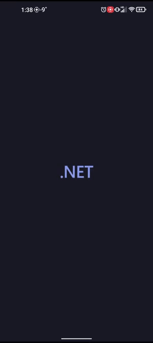
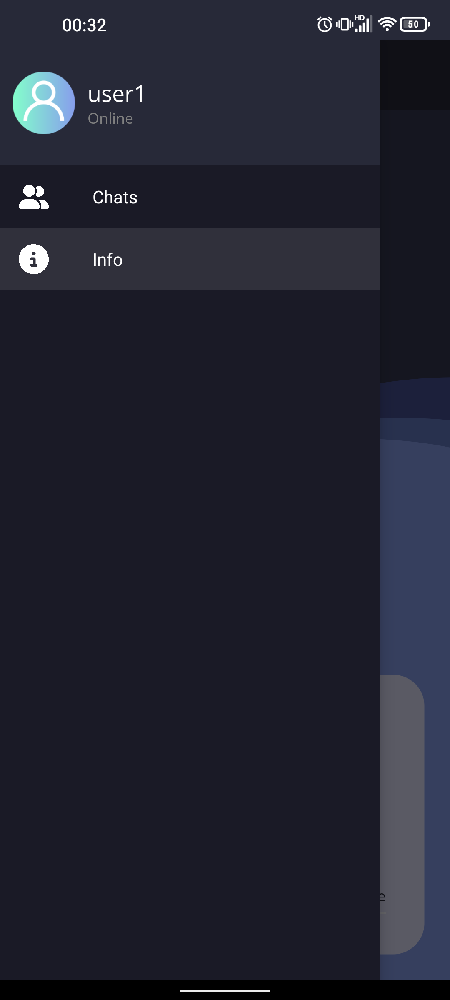
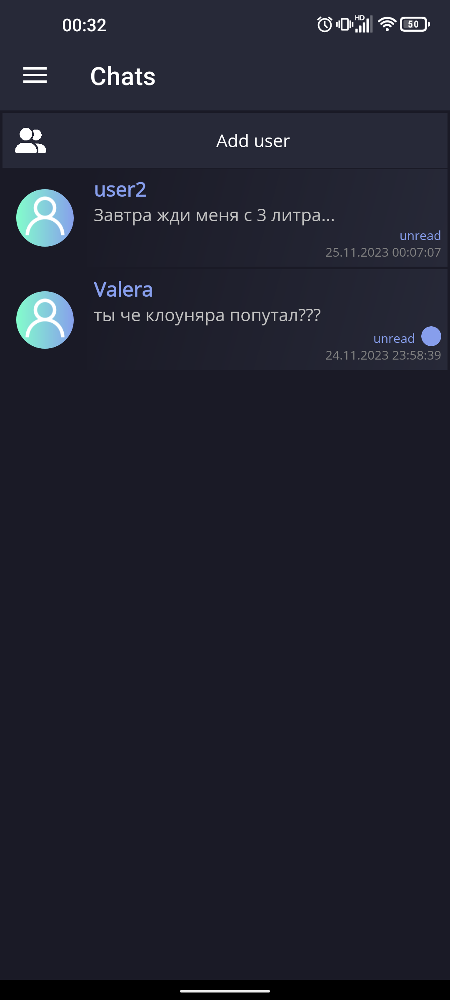
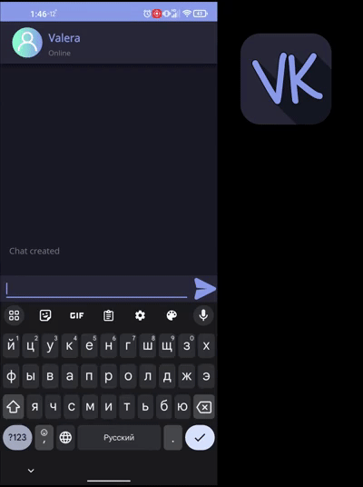
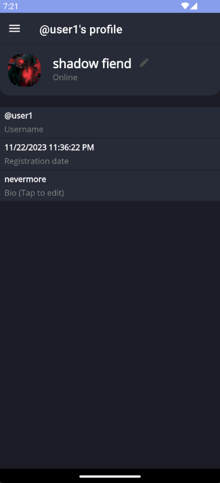
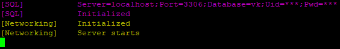
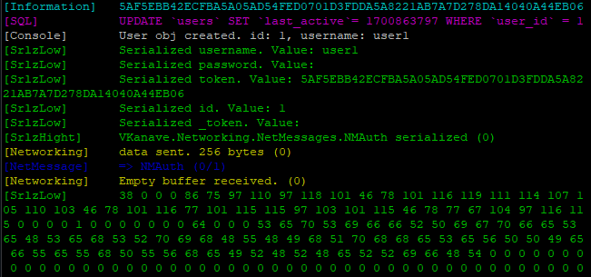

<h1 align="center">
    🌿  VKanave 🌿
</h1>

<h2 align="center">
<b>Добро пожаловать в прекрасную ВКанаву.</b>
</h2>

| Авторизация | Создание чата |
|--|--| 
|  |  |

| Всплывающее меню | Чаты |
|--|--| 
|  |  |

 



# Реализовано:

* [Отправка и принятие данных](VKanaveServer/Core/Networking.cs)
    - из NetworkStream читаются данные размером в NetMessage.BUFFER_SIZE. Далее данные добавляются в массив. После этого они десериализируется в дочерний объект NetMessage
* [Бинарная сериализация объектов](VKanaveServer/Core/NetMessages/NetMessage.cs)
    - Объект NetMessage хранит массив байт (_buffer), в который записывается информация о сетевом пакете. Например, для записи числа используется метод Write(Int32), который используется Write(Byte[])
  ```cs
  protected void Write(byte[] bytes)
    {
        int size = bytes.Length;
        Resize(size);
        for (int i = 0; i < bytes.Length; i++)
        {
            _buffer[_position + i] = bytes[i];
        }
        _position += bytes.Length;
    }
  
* MVVM
* Anti SQL Injection
* Регистрация и авторизация
* Настройка личного профиля
    - Изменение отображаемого имени
* Отправка и получения сообщений
* [Флаги сообщений](VKanaveServer/Core/NetObjects/ChatMessageFlags.cs), которые меняются в реальном времени
    - Удаление сообщений
    - Показывает прочитали сообщение или нет в реальном времени
* Удобный просмотр полных логов
    - Можно отключить нежелаемые логи [здесь](https://github.com/blyatArtem/VKanave/blob/6ecf83cecd937647985997635a62bfe831a05b1d/VKanaveServer/Program.cs#L86)

# Компиляция

### Android (client)

[.bat file](VKanave/compile.bat)

```sh
dotnet publish -c release -r ubuntu.20.04-x64
```
[.bat file](VKanaveServer/compile.bat)

### Ubuntu 20.04-x64 (server)

```sh
dotnet publish -c release -f:net8.0-android
```
[.bat file](VKanaveServer/compile.bat)

# Запуск сервера

> [!NOTE] 
> Установка на Ubuntu.20.04-x64
> 
Устанавливаем mysql-server

```bash
sudo apt install mysql-server
```

Устанавливаем и настраиваем apache и phpmyadmin. Открываем порты и выдаём права доступа программе.

```shell
sudo apt install vsftpd
sudo ufw allow 20,21,990/tcp
sudo ufw allow 40000:50000/tcp
sudo ufw enable
sudo chmod 777 VKanave
```

Запускаем (с использованием мультиплексора)

```shell
tmux new -s vkanave
./VKanave
```

## Результат:




