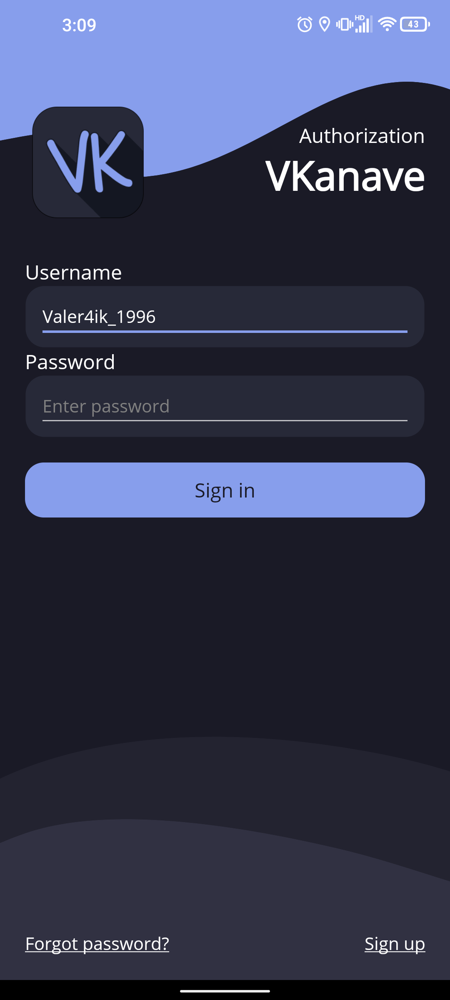
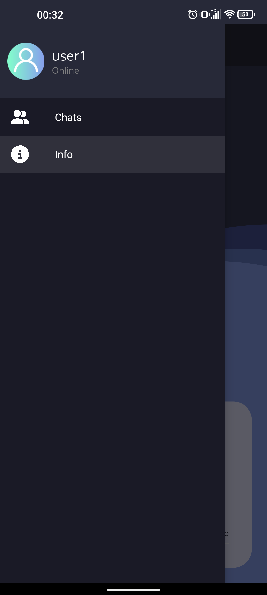
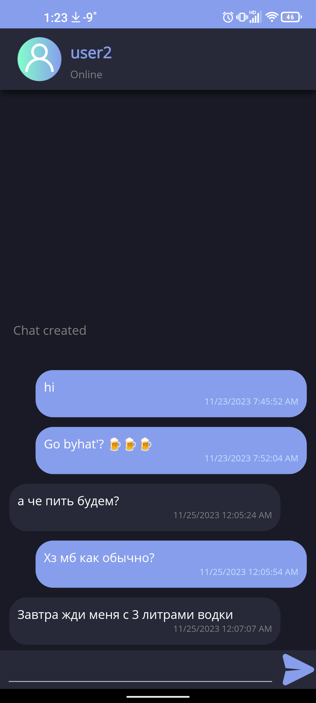
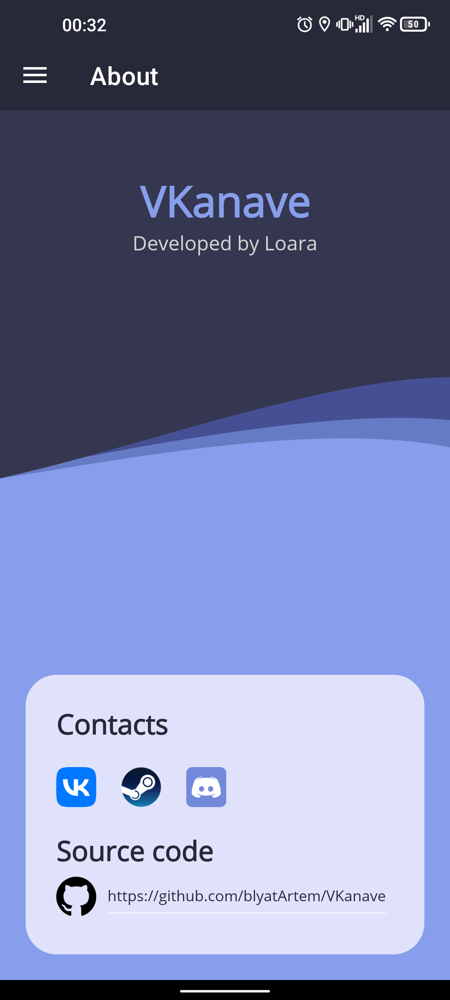
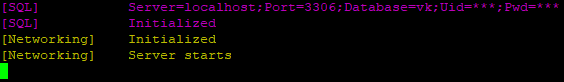
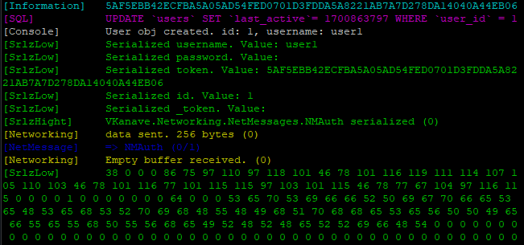

<h1 align="center">
    🌿  VKanave 🌿
</h1>

<h2 align="center">
<b>Добро пожаловать в прекрасную ВКанаву.</b>
</h2>

| Авторизация | Чаты | Всплывающее меню | Чатик |
|--|--|--|--|
|  |  |  |  |



# Компиляция

### App

[Android](VKanave/compile.bat)

### Server

[Ubuntu 20.04-x64](VKanaveServer/compile.bat)

# Запуск сервера

> [!NOTE] 
> Установка на Ubuntu.20.04-x64
> 
Устанавливаем mysql-server

```bash
sudo apt install mysql-server
```

Устанавливаем и настраиваем apache и phpmyadmin. Открываем порты и выдаём права доступа программе.

```shell
sudo apt install vsftpd
sudo ufw allow 20,21,990/tcp
sudo ufw allow 40000:50000/tcp
sudo ufw enable
sudo chmod 777 VKanave
```

Запускаем (с использованием мультиплексора)

```shell
tmux new -s vkanave
./VKanave
```

## Результат:




